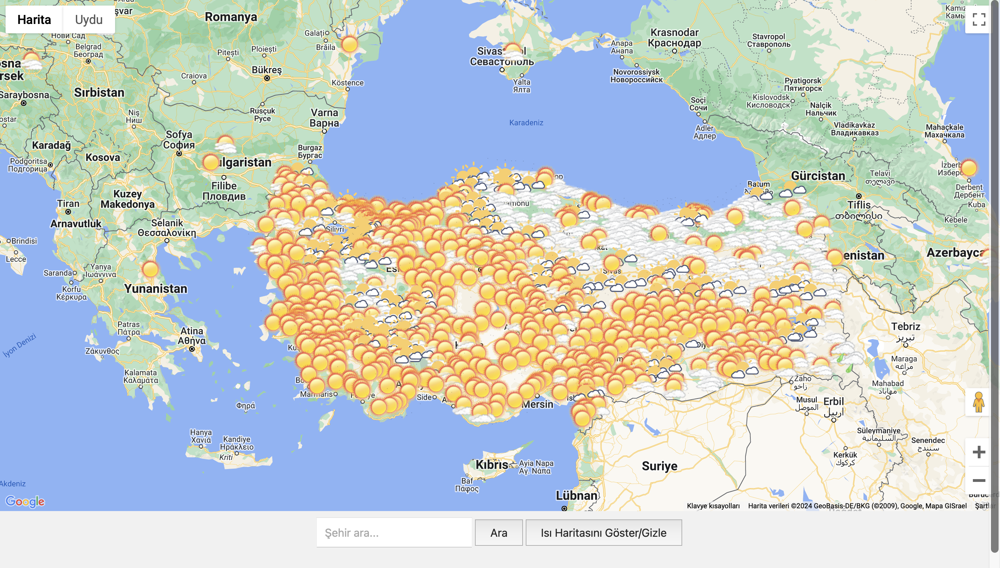
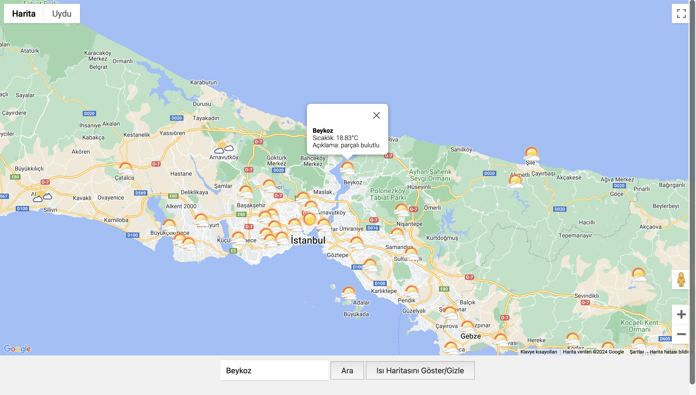
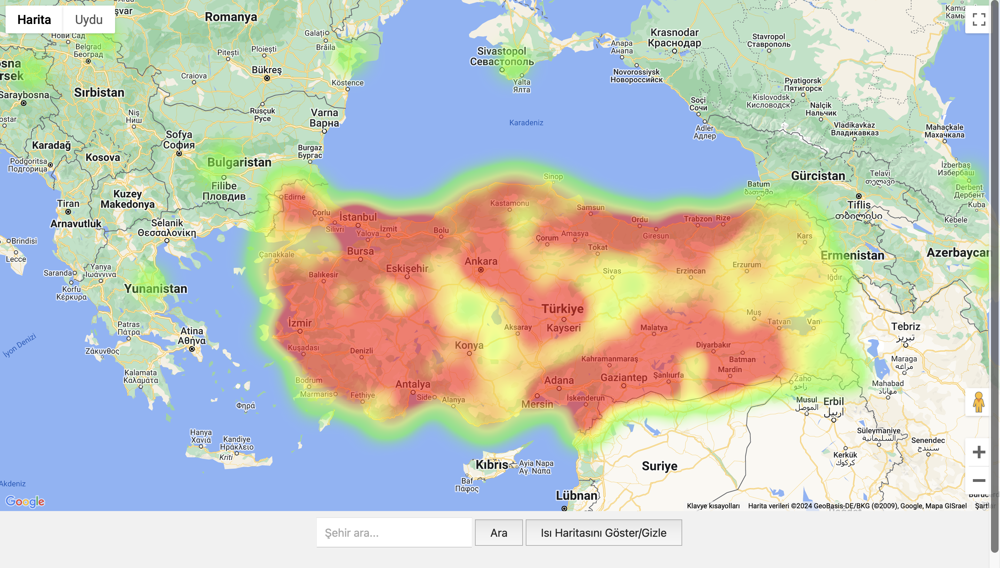

# Projenin Genel Özeti
Bu proje, kullanıcıların Türkiye genelindeki şehir ve ilçelerin anlık hava durumu bilgilerine kolayca ulaşmalarını sağlayan bir hava durumu web sitesidir. Kullanıcılar, harita üzerinde hava durumu ikonları ve ısı haritası sayesinde görsel olarak bilgilere erişebilirler.

# Projeyi Nasıl İndirebiliriz?

Projeyi indirmek için aşağıdaki adımları izleyebilirsiniz:

GitHub deposuna gidin: https://github.com/Current-Weather/Current-Weather.git 

"Code" butonuna tıklayın.

"Download ZIP" seçeneğini seçin veya SSH/HTTPS kullanarak depoyu klonlayın:

```
git clone https://github.com/Current-Weather/Current-Weather.git
```

# Projeyi Nasıl Çalıştırabiliriz?

Projeyi yerel makinenizde çalıştırmak için şu adımları izleyin:

1. Gerekli bağımlılıkları yükleyin:

```
pip install flask
```

```
pip install pymongo
```

```
pip install json
```

```
pip install requests
```

2. Geliştirme sunucusunu başlatın:

3. Tarayıcınızda http://localhost:3000 adresine gidin.

# Proje Geliştirilirken Hangi Teknolojilerden Yararlanıldı

* HTML&CSS: Temel yapı ve stil için
* Python: Sunucu tarafı geliştirme için
* JavaScript: Dinamkik bir web sayfası oluşturmak için
* OpenWeatherMap API: Hava durumu verilerini almak için
* Google Maps API: Harita entegrasyonu için
* MongoDB: API'den hava durumu verilerini tutmak için

# Proje Poster


# Graphical Abstract


# Proje Ekran Görüntüleri
1. Hava Durumu:


2. Hava Bilgisi:


1. Hava Durumu:


# Projeye Eklemek İstediklerimiz

* Rüzgar haritası: Anlık rüzgar hızlarını ve yönlerini görsel olarak sunan harita
* Yağış haritası: Anlık yağış miktarını ve dağılımını gösteren harita
* Tarihsel veriler: Geçmiş hava durumu bilgilerine erişim

# Projeyi Geliştirenler

* Zeynep AKSOY
* Asude TİMUR

# Kaynaklar

* https://openweathermap.org
* https://www.google.com/maps
* https://medium.com/@MakeComputerScienceGreatAgain/demystifying-graph-implementation-in-programming-a-comprehensive-guide-b856712b2b1c
* https://www.mgm.gov.tr/site/yardim1.aspx?=Simgeler
